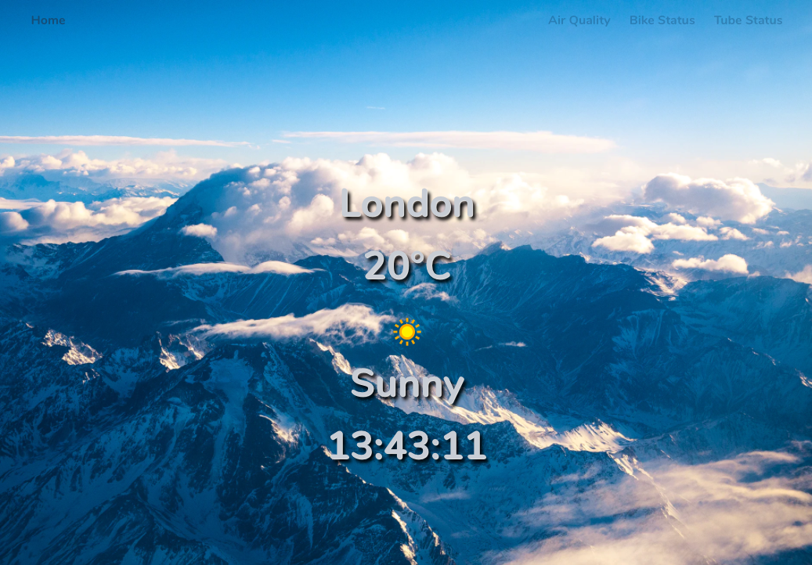
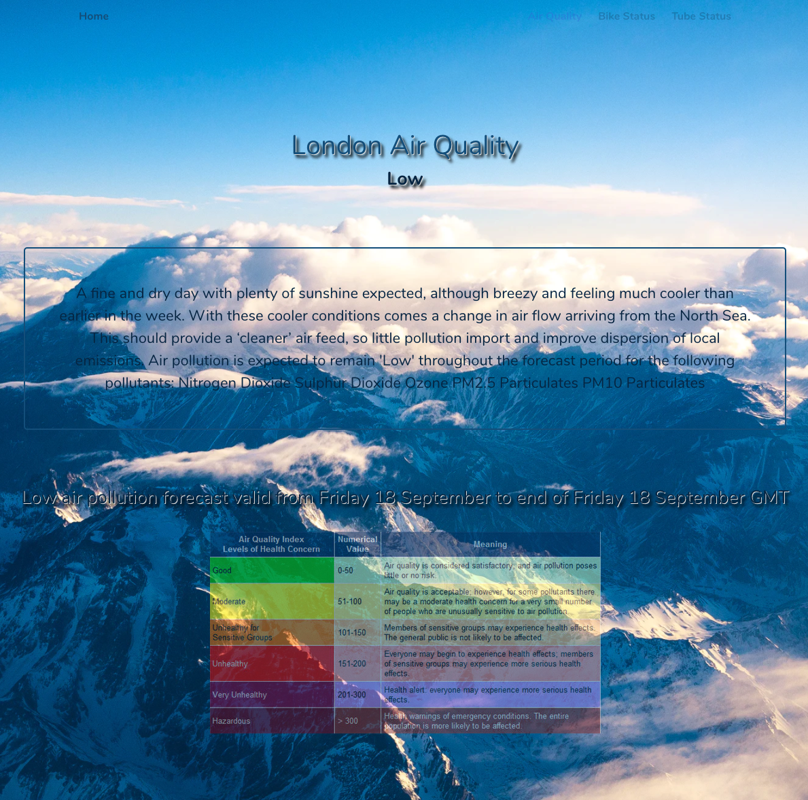
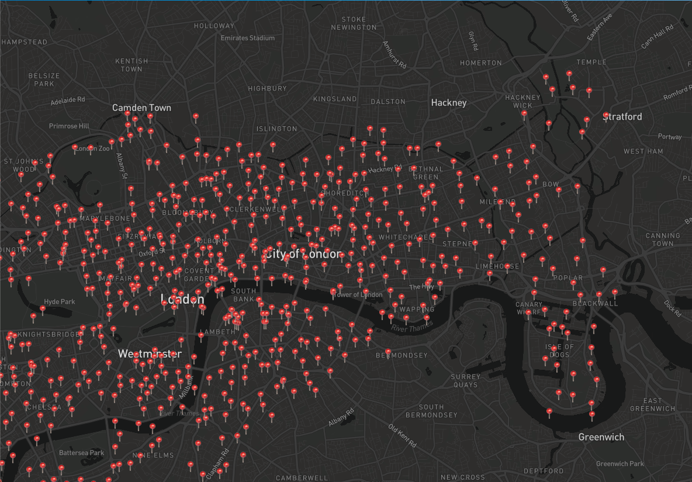

# General Assembly SEI-49 | Project 2 - Weather,  Tube, Air Quality App

## Technical brief
* 48 hour hack-a-thon in a paired group.
* **Have several components** - At least one classical and one functional.  
*  **The app can have a router** - with several "pages", this is up to your disgression and if it makes sense for your project.
* **Must use** a public API
* **Include wireframes** - that you designed before building the app.  
---
## Technologies:
* HTML5
* SCSS/CSS/Bulma
* ReactJS
* JavaScript (ES6)
* Insomnia
* MapBox
* 4 API Implementation
--- 
## Overview

Should you choose to clone our repo:  
To install all the packages listed in the package.json: `yarn add ` 

 

To open the page -> `yarn start`

 
--
 
As we were both conscious of the absolute necessity to reduce the pollution levels in all major cities in the world, we decided to offer uses an efficient app returning:

-   Current Weather
-   Interactive Map with all available bike points
-   Information related to pollution metrics

---
## Processes
* To efficiently find our idea, we quickly came to an agreement on 3 different themes.
* From this point we actively searched for the APIs that were easely accessible, verifying the Data syntax through Insomnia.
* Once validated, VSCode offers the possibility to live share which we used to work on separated component, together.
* This was incredibly efficient as it allowed us to directly discuss & validate the way we wanted to structure or render our project.

## Challenges
* Implementing MapBox without being prior shown.
* Bulma - everything we tried was being overridden.

## Wins
* Calling 4 APIs within 48h in a React with no previous experience was a real challenge, therefore incredibly rewarding.
* Using my previous professional experiences to organise & ensure an efficient pair coding ; working all objectives with Brenda Ty was an absolute pleasure.

## Future development
* Working on 4 APIs was an incredible learning curve but to the cost of our render (SCSS).
* With more experience, Brenda Ty & myself will definitely revisit our App in order to offer a better product & user experience.

---
## Used Resources
* [TfL API](https://api.tfl.gov.uk/)
* [OpenWeatherAPI](https://openweathermap.org/api)
